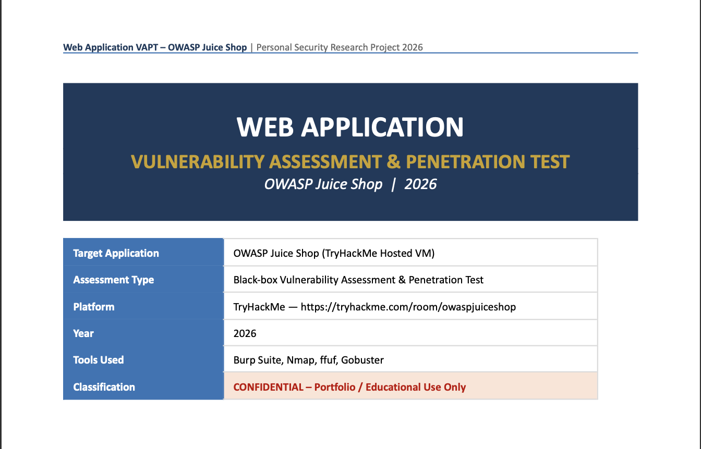
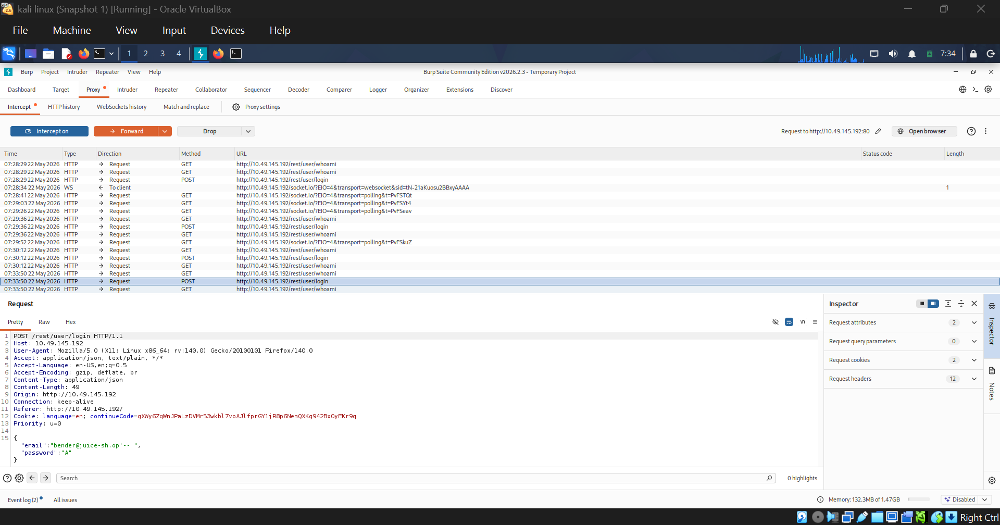
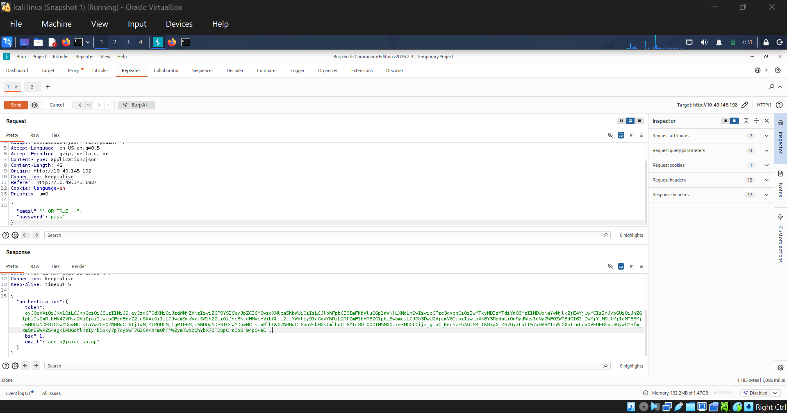
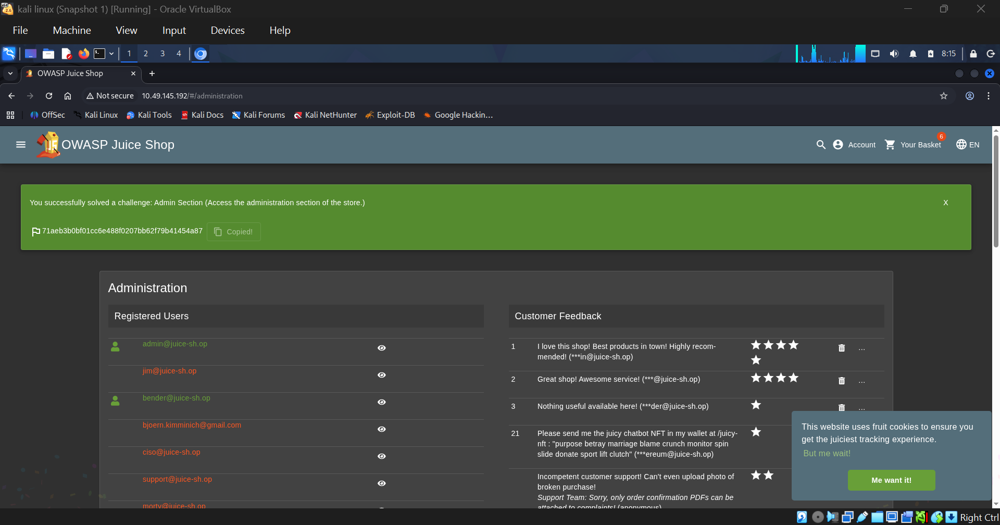

# Web Application VAPT – OWASP Juice Shop

> Personal Web Application Vulnerability Assessment & Penetration Testing Project conducted on OWASP Juice Shop using a TryHackMe hosted environment.



---

## 📌 Project Overview

This project documents a complete **black-box VAPT assessment** performed against the intentionally vulnerable **OWASP Juice Shop** application.

The objective of this project was to gain practical experience in:

- Web Application Penetration Testing
- OWASP Top 10 vulnerabilities
- Reconnaissance & Enumeration
- Exploitation Techniques
- Security Reporting & Documentation

The assessment was conducted in a **legal lab environment** using the TryHackMe platform.

---

## 🛠️ Tools Used

| Tool | Purpose |
|------|----------|
| Burp Suite | Interception & exploitation |
| Nmap | Port scanning & service discovery |
| ffuf | Directory fuzzing |
| Gobuster | Enumeration |
| Browser DevTools | API & JS analysis |
| SecLists | Password brute-force wordlists |

---

## 🎯 Vulnerabilities Explored

| ID | Vulnerability | Severity |
|----|---------------|----------|
| F-01 | SQL Injection – Admin Login Bypass | Critical |
| F-02 | SQL Injection – User Enumeration | High |
| F-03 | Broken Authentication / Brute Force | High |
| F-04 | Sensitive Data Exposure | High |
| F-05 | Broken Access Control | High |
| F-06 | Cross-Site Scripting (XSS) | Medium |
| F-07 | Insecure API Exposure | Medium |
| F-08 | Hidden Route Discovery | Low |

---

## 🔍 Reconnaissance & Enumeration

### Nmap Scan
```bash
nmap -sV -sC -p- <TARGET_IP>
```

### ffuf Enumeration
```bash
ffuf -w /usr/share/wordlists/dirb/common.txt -u http://<TARGET_IP>/FUZZ
```

### Gobuster
```bash
gobuster dir -u http://<TARGET_IP> -w directory-list-2.3-medium.txt
```

---

## 📸 Screenshots

### Burp Suite Interception


### SQL Injection Exploit


### Admin Panel Exposure


> Additional screenshots can be found inside the `/images` directory.

---

## 📚 Key Learnings

- Manual SQL Injection exploitation
- Authentication bypass techniques
- REST API security testing
- XSS payload crafting
- Directory & endpoint enumeration
- Role-Based Access Control weaknesses
- Secure coding & remediation practices

---

## 🧠 OWASP Top 10 Coverage

- A01 – Broken Access Control
- A02 – Cryptographic Failures
- A03 – Injection
- A05 – Security Misconfiguration
- A07 – Identification & Authentication Failures

---

## 📂 Repository Structure

```bash
.
├── images/
├── VAPT_OWASPJuiceShop_2026.pdf
├── VAPT_OWASPJuiceShop_2026.docx
├── README.md
```

---

## ⚠️ Disclaimer

This project was performed strictly for **educational purposes** in a controlled lab environment using an intentionally vulnerable application.

No unauthorized testing was performed against real-world systems.

---

## 🔗 References

- OWASP Top 10  
- OWASP Juice Shop  
- TryHackMe  
- Burp Suite Documentation  
- SecLists  

---

## 👨‍💻 Author

**Mayank Agarwal**  
Cybersecurity Enthusiast | Web App Pentesting | Security Research

- Portfolio: https://mayankagarwalportfolio.netlify.app
- LinkedIn: https://www.linkedin.com/in/mayankxagarwal

---
